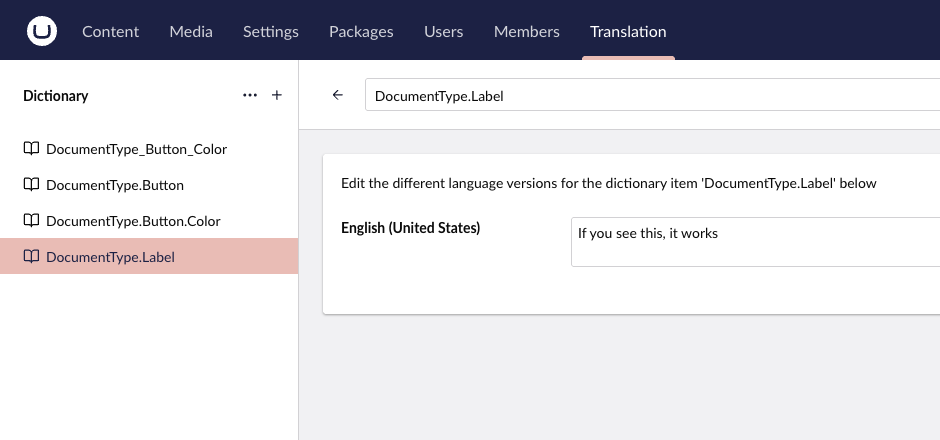
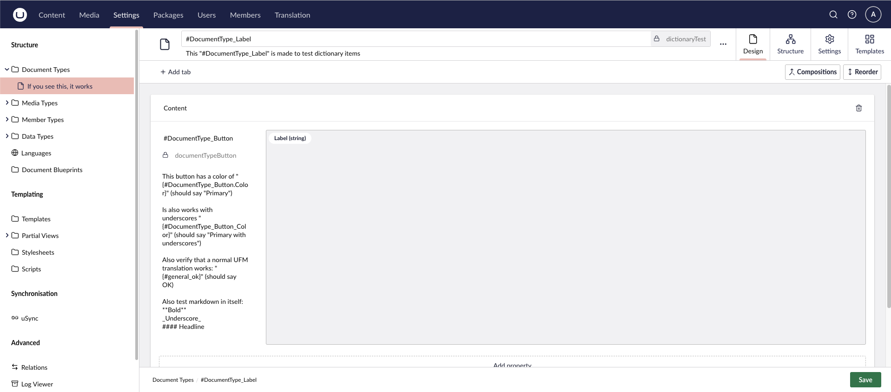
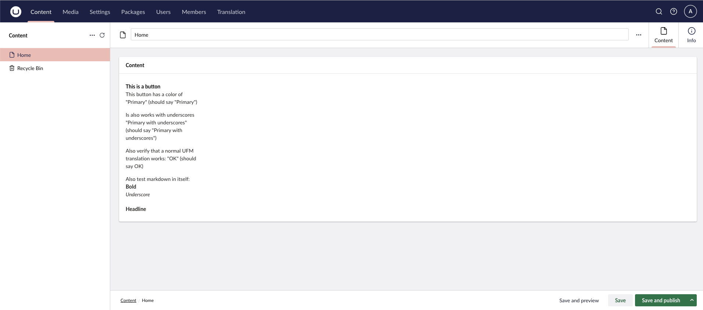

# Usage Guide

This guide explains how to use Lexicon to localize your Umbraco backoffice using dictionary items.

## Quick Overview


*Step 1: Create dictionary items with keys in `Area_Key` format*


*Step 2: Reference dictionary keys in document type labels and descriptions*


*Step 3: Editors see translated values in the content editor*

## Dictionary Key Format

Dictionary keys must follow a specific format to be recognized by Lexicon:

```
Area_Key
```

or

```
Area.Key
```

The first `_` or `.` in the key separates the **area** from the **key**. Any subsequent underscores or dots are preserved in the key portion.

### Examples

| Dictionary Key | Area | Key |
|----------------|------|-----|
| `Article_Title` | Article | Title |
| `Form.Submit` | Form | Submit |
| `Article_Button_Label` | Article | Button_Label |
| `DocumentType.Field.Name` | DocumentType | Field.Name |

### Invalid Keys

Keys without a separator or with a separator at the start/end are ignored:

- `NoSeparator` - No `_` or `.`
- `_StartsWithUnderscore` - Separator at start
- `EndsWithDot.` - Separator at end

## Using Dictionary Values in the Backoffice

Once your dictionary items are set up, reference them in document type configurations. The syntax differs depending on the field type:

### Labels (property labels, tab names, group names)

Use the `#` prefix without curly braces:

```
#Area_Key
```

### Descriptions (UFM-enabled fields)

Use curly braces with the `#` prefix:

```
{#Area_Key}
```

This is [Umbraco Flavoured Markdown](https://docs.umbraco.com/umbraco-cms/reference/umbraco-flavored-markdown) (UFM) syntax.

### Where You Can Use It

| Field | Syntax |
|-------|--------|
| Property labels | `#Area_Key` |
| Tab names | `#Area_Key` |
| Group names | `#Area_Key` |
| Property descriptions | `{#Area_Key}` |

### Example

1. Create a dictionary item with key `Article_Title` and value "Article Title"
2. In a document type, set a property label to `#Article_Title`
3. The backoffice will display "Article Title"

## Multi-Language Support

Lexicon automatically handles translations for all languages configured in your Umbraco installation.

### Content Language Requirement

**Important**: You must create a content language for each UI language you want to support.

For example, if your editors use Danish (`da`) as their backoffice UI language:

1. Go to **Settings** → **Languages**
2. Add Danish as a content language (if it doesn't already exist)
3. Add Danish translations to your dictionary items

Lexicon only outputs translations for languages that exist as content languages in Umbraco.

### How It Works

1. Add translations to your dictionary items for each language
2. The backoffice displays the correct translation based on the user's UI language preference

For example, if you have:

| Key | en-US | da-DK |
|-----|-------|-------|
| `Article_Title` | Article Title | Artikel titel |

A user with English locale sees "Article Title", while a Danish user sees "Artikel titel".

## Caching

Dictionary values are loaded when Umbraco starts. If you add or modify dictionary items, you need to restart the application for changes to take effect.

## Limitations

- Dictionary keys must contain `_` or `.` to be recognized
- Keys must have exactly two levels (area and key)
- Content languages must exist for each UI language you want to support
- Changes require an application restart
- The syntax (`#Area_Key` / `{#Area_Key}`) differs from Umbraco 13's `#Key`

See the [Migration Guide](migration.md) for more details on differences from Umbraco 13.
